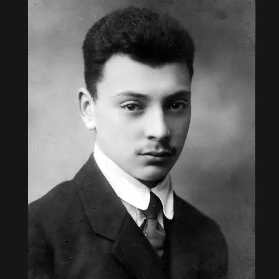
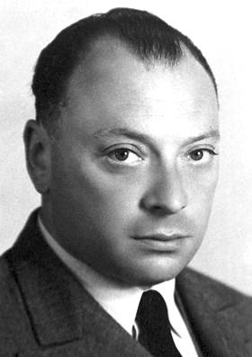

<a href="https://anshium.github.io/">Home</a>

# POIS Endsem Explanations

Quantum Mechanics does freak me out at times. I do admit messing up the QM part in Science-1 and it took me way long to get these things through science courses.

But these problems were the first time I found QM to get me hooked to how cool applications it has.

- [Topic 3: Basics of QM](#topic-3-basics-of-qm)
- [Topic 4: BB84 Quantum Key Distribution](#topic-4-bb84-quantum-key-distribution)
- [Topic 5: Quantum Teleportation](#topic-5-quantum-teleportation)
- [Topic 6: The No-Cloning Theorem](#topic-6-the-no-cloning-theorem)
- [Topic 7: The EPR Paradox](#topic-7-the-epr-paradox)

I would start with the first section:

## Topic 3: Basics of QM

#### Problem 8
While it says basics of QM, it certainly bombards you with seemingly complex ideas of Hilbert Spaces. I am not very good at definitions but I found that Hilbert space is just Euclidean space extended to many dimensions.

So instead of (x, y, z), you have more (x, y, z, a, b, c, d, A, n, s, h, C, ...)

And just this knowledge makes Problem 8 very simple and smooth like Amul Butter 😋

Vectors are linearly dependent if somehow you can add them in a way that makes them zero. If you can, then yes they are linearly dependent.

Let's see what magic can I cook (can you cook magic?)

We have P1 = (1, -1)

P2 = (1, 2)

and P3 = (2, 1)

So, let's assume for some `a`, `b`, `c`,

a*P1 + b*P2 + c*P3 = 0

=>

$$a(1,-1) + b(1,2) + c(2,1) = (0,0)$$

$$(a + b + 2c,\; -a + 2b + c) = (0,0)$$

So we get the system:

$$a + b + 2c = 0$$

$$-a + 2b + c = 0$$

Add the equations:

$$3b + 3c = 0 \Rightarrow b = -c$$

Substitute back:

$$a + (-c) + 2c = 0 \Rightarrow a + c = 0 \Rightarrow a = -c$$

So:

$$a = -c,\quad b = -c$$

Pick $$ c = 1 $$:

$$a = -1,\quad b = -1,\quad c = 1$$

Check:

$$-1(1,-1) + -1(1,2) + 1(2,1) = (0,0)$$

We do get 0! Which means they are linearly dependent.

#### Problem 9

That was pretty easy. Now we get into something more complex. Who is the Pauli?

I looked up and the guy looked like this:

When young:

But then he got older:

Now, I wouldn't really go to the solution directly but will first try to understand the question myself one by one.

The Pauli Matrices are given by:

$$
X =
\begin{pmatrix}
0 & 1 \\
1 & 0
\end{pmatrix}
$$

$$
Y =
\begin{pmatrix}
0 & -i \\
i & 0
\end{pmatrix}
$$

$$
Z =
\begin{pmatrix}
1 & 0 \\
0 & -1
\end{pmatrix}
$$

For now, I will take it as a fact that they look like this.

and it is says something which I cannot understand. It says that these can be considered operators with respect to the orthonormal basis $\vert 0\rangle$, $\vert 1\rangle$ for a 2D Hilbert Space.

It said too many things. I will try to break it down.

First I do understand the Hilbert Space (looked at it when seeing Problem 8 - that it is just your normal Euclidean space extended to more dimensions)

So so so,

Now what is orthonormal basis? Don't think it has to do anything with Quantum. Orthonormal is just ortho + normal.

Ortho means bones... no wait 😂.. ortho means they are orthogonal (perpendicular) to each other.

But what are perpendicular to each other?

$\vert 0\rangle$ and $\vert 1\rangle$.

$\vert 0\rangle = \begin{pmatrix} 1 \\ 0 \end{pmatrix}$ and $\vert 1\rangle = \begin{pmatrix} 0 \\ 1 \end{pmatrix}$

So yes these are orthogonal. Which we can easily see if we take the dot product.
$$(1i + 0j) \cdot (0*i + 1*j) = 0$$

Now what does, "can be considered as operators" mean? It simply means that you can multiply it with other things.

You can do $X \vert 0\rangle$, etc. Just that.

Now we have to express each of these "Pauli operators" in the outer-product notation.

Outer product looks like $\vert a\rangle\langle b\vert $. It is when two basis vectors fall in love.

You can have four cases:

$$ \vert 0\rangle\langle 0\vert  = \begin{pmatrix} 1 \\ 0 \end{pmatrix} \begin{pmatrix} 1 & 0 \end{pmatrix} = \begin{pmatrix} 1 & 0 \\ 0 & 0 \end{pmatrix} $$

$$ \vert 0\rangle\langle 1\vert  = \begin{pmatrix} 1 \\ 0 \end{pmatrix} \begin{pmatrix} 0 & 1 \end{pmatrix} = \begin{pmatrix} 0 & 1 \\ 0 & 0 \end{pmatrix} $$

$$ \vert 1\rangle\langle 0\vert  = \begin{pmatrix} 0 \\ 1 \end{pmatrix} \begin{pmatrix} 1 & 0 \end{pmatrix} = \begin{pmatrix} 0 & 0 \\ 1 & 0 \end{pmatrix} $$

$$ \vert 1\rangle\langle 1\vert  = \begin{pmatrix} 0 \\ 1 \end{pmatrix} \begin{pmatrix} 0 & 1 \end{pmatrix} = \begin{pmatrix} 0 & 0 \\ 0 & 1 \end{pmatrix} $$

If we have these, then we can just add and subtract these in ways to get our Pauli Matrices like follows:

$$
X = \lvert 0\rangle\langle 1\rvert + \lvert 1\rangle\langle 0\rvert
$$

$$
Z = \lvert 0\rangle\langle 0\rvert - \lvert 1\rangle\langle 1\rvert
$$

$$
Y = i\lvert 1\rangle\langle 0\rvert - i\lvert 0\rangle\langle 1\rvert
$$

Easy peasy sneezy

#### Problem 10

That was another easy one, now onto Problem 10.

I would really just ignore the Medium and Hard tags and I think it was really stupid of the TAs to put it and intimidate students about the perceived difficulty. People go on solving unsolved problems if no one told them they were unsolved.

Anyways, Eigendecomposition - too big of a word but of Pauli Matrices which we know about.

Let me search for the word Eigendecomposition:

So basically we do something that lets us get eigenvectors and eigenvalues.

I have now also forgotten much of eigenvectors and eigenvalues but let's see how much can I do.

According to the question, we need to find the eigenvectors, eigenvalues and something else - diagonal (spectral) represntations (which I will ignore for now and find later)

of Pauli Matrices X, Y, Z.

This is what I will do first and then see what the other part of the question says.

To find the eigen value we just do

$$
\det(A - \lambda I) = 0
$$

(just remember this!)

And doing this, we get,

For $$Z = \begin{pmatrix} 1 & 0 \\ 0 & -1 \end{pmatrix}$$:

$$
\det \begin{pmatrix} 1 - \lambda & 0 \\ 0 & -1 - \lambda \end{pmatrix}
= (1 - \lambda)(-1 - \lambda) = 0
$$

$$
\lambda = \pm 1
$$

For $$X = \begin{pmatrix} 0 & 1 \\ 1 & 0 \end{pmatrix}$$:

$$
\det \begin{pmatrix} -\lambda & 1 \\ 1 & -\lambda \end{pmatrix}
= \lambda^2 - 1 = 0
$$

$$
\lambda = \pm 1
$$

For $$Y = \begin{pmatrix} 0 & -i \\ i & 0 \end{pmatrix}$$:

$$
\det \begin{pmatrix} -\lambda & -i \\ i & -\lambda \end{pmatrix}
= \lambda^2 - 1 = 0
$$

$$
\lambda = \pm 1
$$

---

Now to find eigenvectors, we have to follow the following procedure

$$
(A - \lambda I)v = 0
$$

Take $$v = \begin{pmatrix} x \\ y \end{pmatrix}$$ and solve explicitly.

---

And doing this would lead us to

For $$Z$$:

$$
\lambda = 1 \Rightarrow (Z - I)v =
\begin{pmatrix} 0 & 0 \\ 0 & -2 \end{pmatrix}
\begin{pmatrix} x \\ y \end{pmatrix} =
\begin{pmatrix} 0 \\ -2y \end{pmatrix} = 0
$$

$$
-2y = 0 \Rightarrow y = 0
$$

$$
v = \begin{pmatrix} x \\ 0 \end{pmatrix} \Rightarrow \text{choose } x=1
\Rightarrow v = \begin{pmatrix} 1 \\ 0 \end{pmatrix}
$$

---

$$
\lambda = -1 \Rightarrow (Z + I)v =
\begin{pmatrix} 2 & 0 \\ 0 & 0 \end{pmatrix}
\begin{pmatrix} x \\ y \end{pmatrix} =
\begin{pmatrix} 2x \\ 0 \end{pmatrix} = 0
$$

$$
2x = 0 \Rightarrow x = 0
$$

$$
v = \begin{pmatrix} 0 \\ y \end{pmatrix} \Rightarrow \text{choose } y=1
\Rightarrow v = \begin{pmatrix} 0 \\ 1 \end{pmatrix}
$$

---

For $$X$$:

$$
\lambda = 1 \Rightarrow (X - I)v =
\begin{pmatrix} -1 & 1 \\ 1 & -1 \end{pmatrix}
\begin{pmatrix} x \\ y \end{pmatrix} =
\begin{pmatrix} -x + y \\ x - y \end{pmatrix} = 0
$$

$$
-x + y = 0 \Rightarrow y = x
$$

$$
v = \begin{pmatrix} x \\ x \end{pmatrix} \Rightarrow \text{choose } x=1
\Rightarrow v = \begin{pmatrix} 1 \\ 1 \end{pmatrix}
$$

Normalize:

$$
\frac{1}{\sqrt{2}} \begin{pmatrix} 1 \\ 1 \end{pmatrix}
$$

---

$$
\lambda = -1 \Rightarrow (X + I)v =
\begin{pmatrix} 1 & 1 \\ 1 & 1 \end{pmatrix}
\begin{pmatrix} x \\ y \end{pmatrix} =
\begin{pmatrix} x + y \\ x + y \end{pmatrix} = 0
$$

$$
x + y = 0 \Rightarrow y = -x
$$

$$
v = \begin{pmatrix} x \\ -x \end{pmatrix} \Rightarrow \text{choose } x=1
\Rightarrow v = \begin{pmatrix} 1 \\ -1 \end{pmatrix}
$$

Normalize:

$$
\frac{1}{\sqrt{2}} \begin{pmatrix} 1 \\ -1 \end{pmatrix}
$$

---

For $$Y$$:

$$
\lambda = 1 \Rightarrow (Y - I)v =
\begin{pmatrix} -1 & -i \\ i & -1 \end{pmatrix}
\begin{pmatrix} x \\ y \end{pmatrix} =
\begin{pmatrix} -x - iy \\ ix - y \end{pmatrix} = 0
$$

From first equation:

$$
-x - iy = 0 \Rightarrow x = -iy
$$

Substitute into second:

$$
i(-iy) - y = (-i^2)y - y = (1)y - y = 0
$$

$$
v = \begin{pmatrix} -iy \\ y \end{pmatrix} \Rightarrow \text{choose } y=1
\Rightarrow v = \begin{pmatrix} -i \\ 1 \end{pmatrix}
$$

Normalize:

$$
\frac{1}{\sqrt{2}} \begin{pmatrix} 1 \\ i \end{pmatrix}
$$

---

$$
\lambda = -1 \Rightarrow (Y + I)v =
\begin{pmatrix} 1 & -i \\ i & 1 \end{pmatrix}
\begin{pmatrix} x \\ y \end{pmatrix} =
\begin{pmatrix} x - iy \\ ix + y \end{pmatrix} = 0
$$

$$
x - iy = 0 \Rightarrow x = iy
$$

Substitute:

$$
i(iy) + y = (-y) + y = 0
$$

$$
v = \begin{pmatrix} iy \\ y \end{pmatrix} \Rightarrow \text{choose } y=1
\Rightarrow v = \begin{pmatrix} i \\ 1 \end{pmatrix}
$$

Normalize:

$$
\frac{1}{\sqrt{2}} \begin{pmatrix} 1 \\ -i \end{pmatrix}
$$

---

Now about the weird diagonal (spectral representation)

Start with outer product:

$$\vert v\rangle \langle v\vert$$

(complete this properly)

Tbh, there was nothing "medium" about it!! This was easy if you look at it, just a lot of work to do.

#### Problem 11

Onto Problem 11

Now achanak se these people have started to say words like Projector

How do I convince people that some projectors (especially the one in the image above does not follow $$P^2 = P$$ obviously)

What is a projector? Well it is just a matrix which when multiplied to another matrix takes it to a different space.

For example:

Take this simple matrix:

$$P = \begin{pmatrix} 1 & 0 \\ 0 & 0 \end{pmatrix}$$

Apply it to a general vector $\begin{pmatrix} x \\ y \end{pmatrix}$:

$$P\begin{pmatrix} x \\ y \end{pmatrix} = \begin{pmatrix} 1 & 0 \\ 0 & 0 \end{pmatrix}\begin{pmatrix} x \\ y \end{pmatrix} = \begin{pmatrix} x \\ 0 \end{pmatrix}$$

So it kept the $x$ component and killed the $y$ component. It projected the vector onto the x-axis. The $y$ part is gone forever.

Now the (a) part

Intutively if we think about it

First time applying P projects onto the direction,

And since we are already in that direction, multiplying it again would not change anything. So it is equivanlent to applying it once or twice or any number of times.

Let's see,

If we are applying a projection on $\vert a\rangle$ hoping to get a component of it along $\vert v\rangle$, we do:

$$ P\vert a\rangle = (\text{something along } \vert v\rangle) $$

If the result is along $\vert v\rangle$, it must look like:

$$ (\text{some number}) \times \vert v\rangle $$

$$ P\vert a\rangle = c\vert v\rangle $$

What should $c$ be?

From linear algebra, we know that is has to be related to the dot product, when we are trying to find the component along a direction.

Dot product in quantum forms is written. (please see this video if if not clear: [Video Link](https://www.youtube.com/watch?v=3N2vN76E-QA&t=98s))

$$ c = \langle v\vert a\rangle $$

So the projection would be:

$$ P\vert a\rangle = (\langle v\vert a\rangle)\vert v\rangle $$

Did you get this part? I did but I am not sure if it is clear here.

Now this is some mathematical (easy) derivation here but not relevant to the question, so I'll skip it.

At the end of the derivation, you eventually end up getting

$$ P = \vert v\rangle\langle v\vert $$

See it works $\rightarrow$

$$ (\vert v\rangle\langle v\vert)\vert\psi\rangle = \vert v\rangle(\langle v\vert\psi\rangle) $$

Solving the actual (a) part problem:

$$ P^2 = (\vert v\rangle\langle v\vert)(\vert v\rangle\langle v\vert) $$

Group it,

$$ = \vert v\rangle(\langle v\vert v\rangle)\langle v\vert $$

(we know that $\langle v\vert v\rangle = 1$) (why? For now just remember)

So, $$ P^2 = \vert v\rangle\langle v\vert = P $$

Kitna easy peasy tha.

Ab (b) We have to show that a normal matrix is Hermitian if and only if it has real eigenvalues which means it lives on the planet Hermi (get it? Martian?)

`if and only if` means that we have to do two things:

1. Show that a normal matrix has real eigenvalues, it is Hermitian

2. Show that a Normal + Hermitian matrix has real eigenvalues

What is Hermitian now?

So numbers can be complex and complex numbers can be put into matrices

Complex numbers can have conjugates, which is just replacing i with -i. So a + bi becomes a - bi, etc.

If we take the conjugate of all the numbers in a matrix and then take its transpose, we would have a matrix's Hermitian. hahahhahahahahaha

$$ a + bi \xrightarrow{\text{Conjugate}} a - bi \xrightarrow{\text{Transpose}} \text{Hermitian Conjugate (} \dagger \text{)} $$

**Part 1: If it's from planet Hermi (Hermitian), its eigenvalues are real**

Let's start with the basic eigenvalue equation:

$$ A\vert v\rangle = \lambda\vert v\rangle $$

Multiply $\langle v\vert$ on both sides. Why? Because it magically gets you to the answer.

$$ \langle v\vert A\vert v\rangle = \lambda\langle v\vert v\rangle $$

But wait, $A$ is Hermitian, which means $A = A^\dagger$. 
If we take the complex conjugate of that whole thing, we get the conjugate of the eigenvalue $\lambda^*$:

$$ \langle v\vert A\vert v\rangle = \langle v\vert A^\dagger\vert v\rangle = \lambda^* \langle v\vert v\rangle $$

So, looking at both equations, $\lambda$ must be exactly equal to its own conjugate:

$$ \lambda = \lambda^* $$

And what kind of numbers are equal to their own conjugates? Real numbers. So $\lambda$ is real.

**Part 2: If it's normal and has real eigenvalues, it's Hermitian**

Fact: Normal matrices are nice because they can always be diagonalised into:

$$ A = UDU^\dagger $$

(where $U$ is unitary and $D$ is a diagonal matrix filled with our eigenvalues).

Now, we already assumed our eigenvalues are real. This means taking the dagger of $D$ does absolutely nothing to it.

$$ D^\dagger = D $$

Let's check if $A$ is Hermitian by taking its dagger:

$$ A^\dagger = (UDU^\dagger)^\dagger $$

When you apply dagger to a product, you reverse the order and dagger everything:

$$ = U^{\dagger \dagger} D^\dagger U^\dagger = U D^\dagger U^\dagger $$

But we just said $D^\dagger = D$, so:

$$ = UDU^\dagger = A $$

Since $A^\dagger = A$, it is Hermitian. Bhup

**Now (c) part. We have to show that $U \otimes V$ is unitary.**

Unitary basically just means that multiplying a matrix by its dagger gives you the Identity matrix $I$.
So we just want to show:

$$ (U \otimes V)^\dagger (U \otimes V) = I $$

Here is a super useful key rule for daggers and tensors:

$$ (U \otimes V)^\dagger = U^\dagger \otimes V^\dagger $$

Let's multiply them together:

$$ (U^\dagger \otimes V^\dagger)(U \otimes V) $$

Another cool tensor property lets us group the first parts together and the second parts together:

$$ = (U^\dagger U) \otimes (V^\dagger V) $$

But hey, we already know $U$ and $V$ are unitary on their own! So $U^\dagger U = I$ and $V^\dagger V = I$.

$$ = I \otimes I = I $$

Done. Kitna easy peasy tha.

Ho gaye basics!! 

## Topic 4: BB84 Quantum Key Distribution

Now whenever I read BB84, I mistake it for the cool BB8 robot. I once tried to make a life-sized version of this cute robot in RRC (along with a life-sized version of Wall-E) but didn't have time and got busy with something else.

Lite, will make these in my 5th year.

Back to BB84

Now why is it called BB84 is because Charles Bennett and Gilles Brassard proposed it in 1984. See two Bs in the surnames.

Honestly this looks complex and I will go slow with it but I do like to think that things aren't that complex and I would eventually figure it out.

I read about it and the idea is very simple.

I am honestly tired with Alice and Bob, I'll use Indian names.

Riya sends a message to Shashank.

She can send in two basis:

### Basis 1 (Z basis)

0 -> $\vert 0\rangle$

1 -> $\vert 1\rangle$

### Basis 1 (X basis)

0 -> $\vert+45^\circ\rangle$

1 -> $\vert-45^\circ\rangle$

Now Riya wants to keep it secret about whatever she wants to say to Shashank. She can obviously go to him and wisper in his ear, but no, she wants to complicate things and make us understand BB84. (how bad jokes are these 🤦‍♂️)

Now she says something in two ways - either she can say it normally (Basis 1) or in a sarcastic tone (Basis 2) and now Shashank (who is a clear example that boys struggle in relationships) has to guess whether she said it normally or sarcastically. Shashank is clueless and he randomly chooses one Basis.

Now if he chooses the same Basis, he would get the same result.

If she said it normally (Basis 1) and he assumed that she said it normally (Basis 1), then life is set. And similary is she said it sarcastically (Basis 2) and he assumes (Basis 2) then life is set again.

The problem is when she says things sarcatically and he hears then normally or vice versa.

Itna to easy hai.

This is literally Problem 12.

I will try to convert everything into math now;

- Basis 1 (normal tone) → Z basis → $$\vert 0\rangle, \vert 1\rangle$$
- Basis 2 (sarcastic tone) → X basis → $$\vert +\rangle, \vert -\rangle$$

(a) If Shashank chooses the wrong basis, the result is random

Suppose she sends:
- $$\vert 0\rangle$$ (normal tone)

But Shashank assumes she is saying in sarcastic tone:
- $$\vert +\rangle, \vert -\rangle$$

Now compute:

$$
\vert +\rangle = \frac{\vert 0\rangle + \vert 1\rangle}{\sqrt{2}}, \quad
\vert -\rangle = \frac{\vert 0\rangle - \vert 1\rangle}{\sqrt{2}}
$$

Probability of getting $$\vert +\rangle$$

$$
\vert \langle + \vert  0 \rangle\vert ^2
= \left\vert \frac{1}{\sqrt{2}}(\langle 0\vert  + \langle 1\vert )\vert 0\rangle\right\vert ^2
= \left\vert \frac{1}{\sqrt{2}}\right\vert ^2
= \frac{1}{2}
$$

---

## Probability of getting $$\vert -\rangle$$

$$
\vert \langle - \vert  0 \rangle\vert ^2 = \frac{1}{2}
$$

---

## Conclusion

When basis is different:
- outcomes are $$1/2, 1/2$$
- completely random
- independent of what she actually sent

This proves part (a)

---

# (b) If Shashank chooses the **correct basis**, result is perfect

Case 1:
- She sends $$\vert 0\rangle$$
- He measures in Z basis

$$
\vert \langle 0 \vert  0 \rangle\vert ^2 = 1
$$

So he gets the correct answer with probability 1.

---

Case 2:
- She sends $$\vert +\rangle$$
- He measures in X basis

$$
\vert \langle + \vert  + \rangle\vert ^2 = 1
$$

Again, perfect match.

---

## Conclusion

When basis matches:
- outcome is deterministic
- Shashank gets exactly what she meant

This proves part (b)

#### Problem 13

Problem 13 looks scary to me. Itna kuch likha hai, samjhna mushil hai.

But very honestly anyone who knows counting can solve it.

The big picture really is:

1. There are 2n total bits. Riya ko itna bolna hai. Kitna bolte hain log. Chup hi nahi hote.
2. Total errors = μn, for some μ.
3. We can randomy pick n check bits.
4. The other n bits are untested.

We literally just have to show that if the bits we are chicken - did I write chicken?!.......... yeah so the bits we are checking, if they look good, then it is very less likely that the remaining bits are bad.

Basically Riya ki 2n baaton mein se koi random n baatein check kar rahe hain aur agar wo theek lagi to bohot kam chance hai ki baki baatein theek nahi hongi. <------- Yahi baat prove karni hai hame.

Mathematically, the probability is very low and shrinks exponentially like

$$ \exp(-\text{constant}\cdot \epsilon^2 n) $$

Read the question 2-3 times and you would really understand that the question is asking this exact thing. Profs have an ability to scare people and not teach them properly, bruh.

Now Riya said $2n$ things and it could have $\mu n$ errors (0 to $2n$ which mean $\mu$ can go from 0 to 2)

Now we are not checking everything. We are just checking $n$ bits and out of those $n$ bits if there are $\delta n$ errors and $(\delta + \epsilon)n$ on the rest. Then we have to show that $\delta = (\mu - \epsilon)/2$.

Tell me which 6th grader would not be able to do it.

Total errors = $\mu n$  
Errors in those checked = $\delta n$  
Errors in those not checked = $(\delta + \epsilon)n$  

So, $\delta n + (\delta + \epsilon)n = \mu n$

$$ \implies (2\delta + \epsilon)n = \mu n $$

$$ \implies \delta = \frac{\mu - \epsilon}{2} $$

Step 2: Count the probability

We are picking $n$ check bits out of $2n$ total bits.

Total ways:

$$ \binom{2n}{n} $$

Favorable case (the "bad" scenario)

We want:
- exactly $\delta n$ errors in check bits
- remaining errors go into the other $n$ bits

Choose errors in check bits:

From total $\mu n$ errors, choose $\delta n$:

$$ \binom{\mu n}{\delta n} $$

Choose correct bits in check bits:

There are $(2-\mu)n$ correct bits total.
We need the rest of check bits to be correct:

$$ n-\delta n=(1-\delta)n $$

So:

$$ \binom{(2-\mu)n}{(1-\delta)n} $$

Total favorable outcomes:

$$ \binom{\mu n}{\delta n} \cdot \binom{(2-\mu)n}{(1-\delta)n} $$

Probability $p$:

$$ p = \frac{\binom{\mu n}{\delta n} \binom{(2-\mu)n}{(1-\delta)n}}{\binom{2n}{n}} $$

#### Part 2: Showing $p \leq \exp[-O(\epsilon^2 n)]$

Okay, Part 2 looks like a nightmare of formulas but it really is just basic algebra and plugging things in. 

We have this big ugly formula for $p$ with all these combinations $\binom{n}{k}$. Combinations have factorials, and factorials are annoying to calculate. 

Stirling's approximation is just a magic wand that converts annoying factorials into nice powers of $e$. 
When you use Stirling's approximation on combinations, it gives you something called the binary entropy function $H(x)$. 

Think of $H(x)$ as a function that just spits out a number. The rule is:

$$ \binom{N}{k} \approx \exp\left( N \cdot H\left(\frac{k}{N}\right) \right) $$

Let's apply this magic wand to all three combinations in our probability $p$. The formula becomes a single big $\exp(...)$ where we just add and subtract the exponents:

$$ p \approx \exp\left[ \mu n \cdot H\left(\frac{\delta}{\mu}\right) + (2-\mu)n \cdot H\left(\frac{1-\delta}{2-\mu}\right) - 2n \cdot H\left(\frac{1}{2}\right) \right] $$

Now remember from earlier, we found that $\delta = \frac{\mu - \epsilon}{2}$. 
Let's plug that into the fractions inside the $H$ functions.

For the first one:
$$ \frac{\delta}{\mu} = \frac{1}{2} - \frac{\epsilon}{2\mu} $$

For the second one:
$$ \frac{1-\delta}{2-\mu} = \frac{1}{2} + \frac{\epsilon}{2(2-\mu)} $$

Agar aap ko dikh raha hoga to they both look like $\frac{1}{2}$ plus or minus something else.

Now, here is another magic trick. The Taylor series tells us that for small values of $x$, the function $H(\frac{1}{2} + x)$ is just:

$$ H\left(\frac{1}{2} + x\right) \approx \ln 2 - 2x^2 $$

So ab we'll just plug this approximation back into our big exponent formula.

For the exponent, all the $\ln 2$ terms magically cancel out.
$$ \mu n \ln 2 + (2-\mu)n \ln 2 - 2n \ln 2 = 0 $$

Only the $-2x^2$ parts are left now.

$$ \text{Leftover Exponent} = - n \epsilon^2 \left( \frac{1}{2\mu} + \frac{1}{2(2-\mu)} \right) $$

If you add those fractions, you get:
$$ = - n \epsilon^2 \left( \frac{1}{\mu(2-\mu)} \right) $$

Since $\mu$ is between 0 and 2, that fraction is just some positive constant number $C$. 

So our probability is literally just:
$$ p \approx \exp(- C \epsilon^2 n) $$

Which is exactly $\exp[-O(\epsilon^2 n)]$. Boom. Done.

I would stop here for a while and reflect upon the abobve solution. I was really scared seeing this but now it is very very clear to me.

#### Problem 14

Problem 14 is also what we see in daily life. There is another girl Arushi who wants to read Riya's messages without getting caught.

Riya sends messages using two styles.

- Basis 1 (normal tone):  
  0 → "main theek hun"  
  1 → "haan chalega mujhe"

- Basis 2 (sarcastic tone):  
  0 → "main theek hun (but actually with 😒 face)"  
  1 → "haan chalega mujhe (but actually with 😒 face)"

So total possible messages:
- "haan chalega mujhe"  
- "main theek hun"  
- "haan chalega mujhe 😒"  
- "main theek hun 😒"

These correspond to:
$$
|0\rangle,\ |1\rangle,\ |+\rangle,\ |-\rangle
$$

Arushi tries to listen in.

But the problem is that even she does not know what is the real tone with with Riya is speaking.

So if she guesses wrong, she misunderstands, sends wrong info to Shashank and gets caught 💀 - uske baad to situation sahi nahi rahegi.

Now assume Arushi has jadui shakti. She can perfectly tell what Riya meant even if tone is unclear.

This means she can distinguish all 4 states perfectly even though they are not orthogonal.

Let's rigorously prove why this would be a disaster, and why it is mathematically impossible.

**1. Compromising the Channel**
If Arushi (our adversary) has this *jadui shakti* to perfectly distinguish the non-orthogonal states $\{ \vert 0\rangle, \vert 1\rangle, \vert +\rangle, \vert -\rangle \}$, she performs an **intercept-resend attack** (just look at this word combination and it would be clear what the attack is). 
She measures Riya's qubit, perfectly identifies the state (say she gets the result that it is $\vert +\rangle$), and records the bit. She then prepares a brand new qubit in the exact same state $\vert +\rangle$ and sends it to Shashank.
Because the state Shashank receives is mathematically identical to the one Riya sent, the channel error rate remains exactly $0\%$. Shashank and Riya will detect no eavesdropping, while Arushi extracts the full key. BB84 is completely compromised.

**2. Conflict with the No-Cloning Theorem**
The No-Cloning Theorem mathematically proves that there exists no unitary operator $U$ such that for arbitrary non-orthogonal states $\vert \psi\rangle$:
$$ U(\vert \psi\rangle \otimes \vert \text{blank}\rangle) = \vert \psi\rangle \otimes \vert \psi\rangle $$
If Arushi could perfectly distinguish the states, she could effectively bypass this theorem. By measuring the state to gain full classical knowledge of its identity, she could instruct a machine to prepare as many identical copies of $\vert \psi\rangle$ as she wants. Because cloning non-orthogonal states is forbidden by quantum mechanics, the ability to perfectly distinguish them must also be forbidden.

This is a direct mathematical contradiction. For perfect distinguishability, this probability had to be $100\%$ (or $1$). 
Thus, such measurement operators cannot exist. Because the states $\vert 0\rangle$ and $\vert +\rangle$ are not orthogonal ($\langle 0 \vert + \rangle = 1/\sqrt{2} \neq 0$), they cannot be perfectly distinguished. Arushi has no jadui shakti. She will always have some confusion.

# Topic 5: Quantum Teleportation

(please watch this video: https://www.youtube.com/watch?v=R8gbj-X1p9w - great fun)

#### Problem 15

Let's forget about Quantum Teleportation for this question since it is not being used here. It is just building the basis.

Let's get a bit into Quantum Concepts. I'll keep a bit serious tone here to explain things properly. Pay close attention.

1. What is a bit (normal computing)

It is just 0 or 1!

2. What is Qubit

It is also a bit (Qu bit) but it can be a mix of both 0 and 1 at the same time. Like a linear combination.

$\vert \psi\rangle = a\vert 0\rangle + b\vert 1\rangle$

$\vert 0\rangle$ = state 0
$\vert 1\rangle$ = state 1

a, b are just some general numbers to tell how a Qubit is formed.

3. Measurement

I do not know how many sci-fi movies have you guys seen but I clearly know from somewhere (I don't know where - maybe Papa told me once) that when we measure a Qubit, it becomes either 0 or 1.

Just measuring it like a chuimui, it changes to either 0 or 1 from whatever combination or blend it was in before.

And probabilities depend on the values a and b as we had before.

Now we will see Quantum Gates

Just like the normal gates

Example: NOT gate (X)

Flips:

$\vert 0\rangle \to \vert 1\rangle$
$\vert 1\rangle \to \vert 0\rangle$

Example: Hadamard (H)

Creates superposition:

$\vert 0\rangle \to \frac{\vert 0\rangle+\vert 1\rangle}{\sqrt{2}}$

Since time is less, I would just say superposition is sum of two states - which is what it really is.

Now, what is a two-qubit system?

If we combine two-qubits, we get a two-qubits system - simpi simpa.

So, $\vert 00\rangle$, $\vert 01\rangle$, $\vert 10\rangle$, $\vert 11\rangle$

These are like all combinations of two bits.

Entanglement (and EPF paradox) can be very easily understood through this video (https://youtu.be/5HJK5tQIT4A?si=LGePtfQKJEQLSgYO)

Without going into much physical significance, let's solve Q15.

Start with:
$$ \frac{\vert 00\rangle+\vert 11\rangle}{\sqrt{2}} $$

Apply H on first qubit:

$$ \vert 00\rangle \to \frac{\vert 00\rangle + \vert 10\rangle}{\sqrt{2}} $$  
$$ \vert 11\rangle \to \frac{\vert 01\rangle - \vert 11\rangle}{\sqrt{2}} $$

So we get:

$$
\frac{1}{2}(
\vert 00\rangle + \vert 10\rangle + \vert 01\rangle - \vert 11\rangle
)
$$

Now apply CNOT:

$$ \vert 00\rangle \to \vert 00\rangle $$  
$$ \vert 01\rangle \to \vert 01\rangle $$  
$$ \vert 10\rangle \to \vert 11\rangle $$  
$$ \vert 11\rangle \to \vert 10\rangle $$  

So the state becomes:

$$
\frac{1}{2}(
\vert 00\rangle + \vert 01\rangle + \vert 11\rangle - \vert 10\rangle
)
$$

This simplifies to:

$$ \vert 00\rangle $$

So:

$$ \vert \beta_{00}\rangle \xrightarrow{U^\dagger} \vert 00\rangle $$

(and similarly for the other Bell states)

So, the circuit given in the question decodes Bell states into classical bit strings.

Measurement gives one of 00,01,10,11
Each outcome corresponds to exactly one Bell state

Now what does POVM mean?

Behind the scenes, we describe measurement using operators. (remember operations which can my multiplied to things)

For a normal measurement:

$$ M_0 = \vert 0\rangle\langle 0\vert $$

$$ M_1 = \vert 1\rangle\langle 1\vert $$

Now generalize this idea

Instead of just two operators, we can have many:

$$ \{M_0, M_1, M_2, \dots\} $$

This whole set is called a POVM

Now the question asks us to show that the circuit results in a POVM (a set of elements) whose elements are the four projectors (remember projectors?)

From the circuit:

You apply U
Then measure $\vert 00\rangle, \vert 01\rangle, \vert 10\rangle, \vert 11\rangle$

This is equivalent to measuring:

$$ M_{ij} = U^\dagger\vert ij\rangle\langle ij\vert U $$

And this becomes:

$$ M_{ij} = \vert \beta_{ij}\rangle\langle \beta_{ij}\vert $$

What is the cardinality of the POVM?

Cardinality = number of measurement outcomes.

Here:

$$ ij \in \{00, 01, 10, 11\} $$

So:

Cardinality = 4

Finally,

There are 4 Bell states

Each has a measurement operator:

$$ M_{00}, M_{01}, M_{10}, M_{11} $$

Each operator checks one Bell state
Total operators = 4

#### Problem 16

Ignore the title, let's me see what this means. We have a composite system (which means more one one thing is there). $\vert a\rangle$ is a pure state of A and $\vert b\rangle$ is a pure state of B.

What is a pure state?

Pure state just means ki we know the quantum state completely. There are cases when you don't know the quantum state completely. This video is a good explanation: [Video Link](https://youtu.be/gFtt0C4enZA?si=744OMw6O_1nOjr5I)

A pure state can also be written as:

$\rho = \vert \psi\rangle\langle\psi\vert $

just another way to represent the same thing.

For pure states:

$\rho^2 = \rho$

Pavitr cheez mein Pavitr cheez daalo to Pavitr hi hota hai? (Maybe I can remember this properly like this)

I think now we get what a pure state is.

Now I have to show something about the reduced density operator.

What is that now? 😭

Reduced density operator = “what A looks like if I don’t see B”

(to be completed)

#### Problem 17

Let's move on to the last question of Quantum Teleportation. Honestly I have seen no teleportation happening yet.

Let's see what does Problem 17 say.

So again the question does not clarify a lot of things and just assumes the reader to figure it out.

So, me, the reader has to figure this out.😑

I see U being mentioned. I just assume that it is some gate (some operation) we would be doing on a Qubit.

It says that we have two ways to run a circuit:

**Way 1: Controlled-U, then measure**

Starting with the general input:
$$ \vert \psi\rangle = \alpha\vert 0\rangle\vert \phi_0\rangle + \beta\vert 1\rangle\vert \phi_1\rangle $$

Step 1: Apply controlled-$U$. 
Controlled-$U$ just means $U$ is applied to the second qubit *only* if the first qubit is $\vert 1\rangle$. To yahan par second wale se hi multiply hoga.
$$ \xrightarrow{\text{C-U}} \alpha\vert 0\rangle\vert \phi_0\rangle + \beta\vert 1\rangle U\vert \phi_1\rangle $$

Step 2: Measure qubit 1.
Two possibilities (like we know na ki measuring a qubit makes it collapse into one of the two states, and the probability is just the square of the coefficient):

- **Outcome 0** (Probability $\vert \alpha\vert ^2$) $\rightarrow$ State becomes:
  $$ \vert 0\rangle\vert \phi_0\rangle $$

- **Outcome 1** (Probability $\vert \beta\vert ^2$) $\rightarrow$ State becomes:
  $$ \vert 1\rangle U\vert \phi_1\rangle $$

**Way 2: Measure first, then apply $U$ if needed**

Starting with the same input:
$$ \vert \psi\rangle = \alpha\vert 0\rangle\vert \phi_0\rangle + \beta\vert 1\rangle\vert \phi_1\rangle $$

Step 1: Measure qubit 1 immediately.
- **Outcome 0** (Probability $\vert \alpha\vert ^2$) $\rightarrow$ State becomes:
  $$ \vert 0\rangle\vert \phi_0\rangle $$
- **Outcome 1** (Probability $\vert \beta\vert ^2$) $\rightarrow$ State becomes:
  $$ \vert 1\rangle\vert \phi_1\rangle $$

Step 2: Apply $U$ manually depending on the measurement result.
- **If 0**: Do nothing. 
  State remains: $$ \vert 0\rangle\vert \phi_0\rangle $$
- **If 1**: Apply $U$ to the second qubit. 
  State becomes: $$ \vert 1\rangle U\vert \phi_1\rangle $$

**Compare both ways**

Look at the final results! They give:
- The exact same probabilities ($\vert \alpha\vert ^2$ for 0, $\vert \beta\vert ^2$ for 1).
- The exact same final states ($\vert 0\rangle\vert \phi_0\rangle$ and $\vert 1\rangle U\vert \phi_1\rangle$).

So they are identical.

And now we see deferred measurements ka real matlab. You can move measurements later in the circuit without changing results.

Par honestly ye bacchon wale questions jisme bas complex notation aur darane wali cheezein use hui hai wo hum college walon ko de rahe hai aur bol rahe hai Medium Question hai and revise, read notes, don't worry. Kyunn??? Itne asaan questions ke liye. Bhap!!

(put nice explanation of how this principle is used in Quantum Teleportation to justify moving Alice's measurements to the end of the protocol.)

So in Quantum Teleportation, Alice has a qubit she wants to send to Bob. She and Bob share an entangled Bell pair. The protocol has Alice do some gates on her qubit + her half of the Bell pair, and then measure.

Now the deferred measurement principle says: it doesn't matter *when* Alice measures — she can do all her gates first and measure at the very end, and the final outcome is exactly the same. This is what lets us write the teleportation circuit neatly, with all the classical communication (Alice telling Bob her measurement result) happening cleanly at the end, rather than being tangled up in the middle of the circuit. It's just a circuit re-writing trick, but it makes the whole protocol much easier to reason about.

## Topic 6: The No-Cloning Theorem

Firstly watch this video (very good video) and a lot of concepts would be clear:

https://www.youtube.com/watch?v=owPC60Ue0BE

I got lost after 3:25 minutes but at least I know something now, so let's do Problem 18

#### Problem 18

I had explained (in Problem 14) what Perfectly distinguishing non-orthogonal states means and how that is impossible. [Impossible Thing A]

And the video explains how cloning quantum states is impossible. [Impossible Thing B]

Problem 18 just wants us to show if Impossible Thing A can happen then Impossible Thing B can happen and vice versa.

**Part 1: If you can perfectly distinguish, you can clone**

Suppose you have this *jadui shakti* (measurement) that perfectly distinguishes two non-orthogonal states $\vert \psi\rangle$ and $\vert \phi\rangle$. 
This means you have measurement operators $M_\psi$ and $M_\phi$ such that:  
$$ M_\psi\vert \psi\rangle = \vert \psi\rangle, \quad M_\psi\vert \phi\rangle = 0 $$  
$$ M_\phi\vert \phi\rangle = \vert \phi\rangle, \quad M_\phi\vert \psi\rangle = 0 $$

The above equations just mean that if you apply a particular M to measure a particular Qubit, you actually get that value measured.

If this magical machine clicks, you know *with 100% certainty* which state you were given.
If you know exactly what state it is, you can just build a new one in THub.
You basically created a cloning machine:
1. Measure the unknown state.
2. The machine says It's $\vert \psi\rangle$!.
3. You prepare a brand new $\vert \psi\rangle$.

Now you have two of them! You successfully mapped:  
$$ \vert \psi\rangle \to \vert \psi\rangle \otimes \vert \psi\rangle $$  
$$ \vert \phi\rangle \to \vert \phi\rangle \otimes \vert \phi\rangle $$

But we just established from the video that cloning is physically impossible. Since this leads directly to a cloning machine, perfectly distinguishing non-orthogonal states must also be impossible.

**Part 2: If you can clone, you can distinguish**

Now let's go the other way around. Suppose you somehow built a cloning machine (a unitary operator $U$):  
$$ U(\vert \psi\rangle\vert 0\rangle) = \vert \psi\rangle\vert \psi\rangle $$  
$$ U(\vert \phi\rangle\vert 0\rangle) = \vert \phi\rangle\vert \phi\rangle $$

Upar wali machines bas ek (left wale) ko dekh kar right wale 0 par use copy kar rahi hai. Isme koi rocket science nahi hai.

If you have a cloning machine, why stop at two? Just keep feeding the copies back into the machine and print $n$ copies!
Now you have:  
$$ \vert \psi\rangle^{\otimes n} \quad \text{or} \quad \vert \phi\rangle^{\otimes n} $$  

Here is the super cool math trick. The inner product (which tells us how similar or overlapping two states are) for $n$ copies becomes:  
$$ \langle \psi^{\otimes n} \vert \phi^{\otimes n} \rangle = (\langle \psi \vert \phi \rangle)^n $$

Since $\vert \psi\rangle$ and $\vert \phi\rangle$ are not the same state, their overlap $\vert\langle \psi \vert \phi \rangle\vert$ is strictly less than 1 (like 0.8 or something).   
What happens when you take a number less than 1 and raise it to a huge power $n$ as $n \to \infty$? It goes to 0!  
$$ (\text{something} < 1)^\infty \to 0 $$

If their inner product goes to 0, that means the $n$-copy states become practically orthogonal. And remember our rule? Orthogonal states CAN be perfectly distinguished! 
So if you can clone, you can print enough copies to make them perfectly distinguishable.

But again, perfectly distinguishing non-orthogonal states is impossible! So your starting assumption (cloning) must be impossible too. 

**Final Conclusion:**
Perfect distinguishability $\iff$ Cloning.
They both imply each other, and both are mathematically and physically impossible for non-orthogonal states.

Problem 19

I think this Orthogonal thing is getting too out of hand and I need to really understand it properly now. 

So what is the problem asking here?

We have two completely orthogonal states.
(Orthogonal means dot product would be 0 => inner product = 0) (I had put a video before for this)

The key and interesting idea here is that Orthogonal states behave like classical bits.

1. They can be perfectly distinguished
2. so you can copy them

Ab agar 2 cheezein 90 degree pe hain (orthogonal) like $\vert a\rangle,\vert b\rangle$, we can always rotate them to coincide with $\vert 0\rangle$ and $\vert 1\rangle$ since they are also at 90 degrees.

So we can always find a U such that:

$$ U\vert \psi\rangle=\vert 0\rangle, \quad U\vert \phi\rangle=\vert 1\rangle $$

You might have forgotten this but CNOT can be used to copy things:

We know:

$$ \text{CNOT}: \vert x\rangle\vert 0\rangle \to \vert x\rangle\vert x\rangle $$

So in the computational basis:

$$ \vert 0\rangle\vert 0\rangle \to \vert 0\rangle\vert 0\rangle $$

$$ \vert 1\rangle\vert 0\rangle \to \vert 1\rangle\vert 1\rangle $$

Ab ham simply vapis transform kar denge

Full circuit:

1. Apply U to the first qubit
2. Apply CNOT
3. Apply $U^\dagger$ to the first qubit

Verifying it works:

Verify it works
Input: $\vert \psi\rangle\vert 0\rangle$

After U:

$$ \vert 0\rangle\vert 0\rangle $$

After CNOT:

$$ \vert 0\rangle\vert 0\rangle $$

After $U^\dagger$:

$$ \vert \psi\rangle\vert \psi\rangle $$

Input: $\vert \phi\rangle\vert 0\rangle$

After U:

$$ \vert 1\rangle\vert 0\rangle $$

After CNOT:

$$ \vert 1\rangle\vert 1\rangle $$

After $U^\dagger$:

$$ \vert \phi\rangle\vert \phi\rangle $$

Which means cloning works for orthogonal states!

About that connection part, I did not get much but here is what ChatGPT gave:

Cloning is possible exactly when the state contains fully accessible classical information.

Problem 20

I understood this question nicely with ChatGPT and is just math derivations.

Problem 21

Again labelled as hard, this is a bherry bherry pheasy quesson.

**What is given**

Imagine you have a cloning machine (a linear operation $E$) that takes an unknown state $\rho$ and a blank state $\sigma$, and gives you two copies of $\rho$:  
$$ E(\rho \otimes \sigma) = \rho \otimes \rho $$

Let's say it magically works perfectly for two specific states $\rho_1$ and $\rho_2$:  
$$ E(\rho_1 \otimes \sigma) = \rho_1 \otimes \rho_1 $$  
$$ E(\rho_2 \otimes \sigma) = \rho_2 \otimes \rho_2 $$

First step: Consider a mixed state

Let's try to fool the machine. We create a mixed state $\rho$:  
$$ \rho = p\rho_1 + (1-p)\rho_2 $$

This just means: with probability $p$ we feed it $\rho_1$, and otherwise we feed it $\rho_2$.

Now Apply the cloning map

Because quantum mechanics is linear, we get:  

$$ E(\rho \otimes \sigma) = E(p\rho_1 \otimes \sigma + (1-p)\rho_2 \otimes \sigma) $$   

$$ = p E(\rho_1 \otimes \sigma) + (1-p) E(\rho_2 \otimes \sigma) $$

Substitute our known results for $\rho_1$ and $\rho_2$:  

$$ = p(\rho_1 \otimes \rho_1) + (1-p)(\rho_2 \otimes \rho_2) $$

**Step 3: What true cloning SHOULD give**

If the machine *actually* cloned our mixed state $\rho$, we would expect the output to literally be $\rho \otimes \rho$.
Let's see what that looks like:

$$ \rho \otimes \rho = (p\rho_1 + (1-p)\rho_2) \otimes (p\rho_1 + (1-p)\rho_2) $$

Expand this like basic algebra:

$$ = p^2(\rho_1 \otimes \rho_1) + p(1-p)(\rho_1 \otimes \rho_2) + p(1-p)(\rho_2 \otimes \rho_1) + (1-p)^2(\rho_2 \otimes \rho_2) $$  

**Step 4: Compare both results**

Let's look at what the machine actually gave us vs what true cloning should give.

From the linear machine:

$$ p(\rho_1 \otimes \rho_1) + (1-p)(\rho_2 \otimes \rho_2) $$

From true cloning:

$$ p^2(\rho_1 \otimes \rho_1) + p(1-p)(\rho_1 \otimes \rho_2) + p(1-p)(\rho_2 \otimes \rho_1) + (1-p)^2(\rho_2 \otimes \rho_2) $$

There is clearly a difference. The true cloning expression has these weird cross terms: $(\rho_1 \otimes \rho_2)$ and $(\rho_2 \otimes \rho_1)$.
Our linear machine completely missed them. Also, the probabilities are wrong ($p$ instead of $p^2$).

**Step 5: Conclusion**

$$ E(\rho \otimes \sigma) \neq \rho \otimes \rho $$

So the cloning machine fails for mixed states. 

**Final Conclusion:** No linear cloning machine can work for all states.

## Topic 7: The EPR Paradox

This video was great when I looked at it: https://www.youtube.com/watch?v=5HJK5tQIT4A

Let's do problem 22 now:

(write explanation here)

# Topic 8: Shor's Algorithm (Relatively easier to understand)

مان ٿوري دير ۾ ڪندس 😔