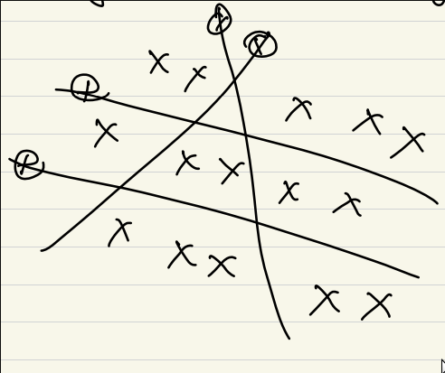

# SMAI Notes

## Class 1 - KNNs

## Limitations of KNNs

### 1. Complexity Problem - Large Dataset

In KNNs, we have to calculate the distance with each point. As the dataset grows, the number of computations increases and KNNs become very slow.

### 2. Curse of Dimensionality

As the dimension of the datapoints increase, the 

### 3. Representation of data

## Represntation of data:

`Problem`: Given one wiki page, we need to find the nearest k pages.

`Bag of Words`: Find all the unique words and make a dictionary. Assign each word to its frequency in the text. Remove the stopwords tho.

### Term Frequency (TF) and Inverse Document Frequency (IDF)

### Term Frequency

$f_{ij}$ = frequency of term i in jth document.

$f_{ij}$ is called `term frequency`.

### Inverse Document Frequency

Terms that appear in many different documents are less indicative of overall topic.

$df_{i}$ = document frequency of term i = number of documents containing the term i

$idf_{i}$ = inverse document frequency of term i = $log_{2}(\frac{N}{df_{i}})$ 

N = Number of documents.

idf is indicated of a term's discrimination power.

Log is used to dampen the effect relative to tf.

### TF-IDF Weighting

Typical combined term importance indicator is tf-idf weighting.

$w_{ij} = tf_{ij}idf_{i} = tf_{i}log_2(N/df_{i})$

This ensures that a term coming very frequently in a document but rarely in other documents, is given a lot of importance.

This formula has been experimentally found to work well.

## The other way of doing tf-idf (for queries).

For queries we use a different way of doing tf-idf, we use a slightly different weighting function.

$w_{i, d} = log(1 + tf_{i, d}) \cdot log_2(N/df_i)$

The only difference is that tf has been replaced by log(1 + tf)

## Approximate KNNs

1. Locally Sensitive Hashing

For one point, find if it is towards or opposite to the origin for each plane.

For each point, make a binary string.

## Distance Functions

1. `Euclidean`: Symmetric, treats all dimensions equally.

$$D(x, x') = \sqrt{\sum_i (x_i-x_i')^2}$$

    Euclidean distance if sensitive to large difference in a single attribute.

2. `Better Version for Euclidean`:

$$D(x, x') = \sqrt{\sum_i \frac{(x_i-x_i')^2}{\sigma_i^2}}$$

3. `Even Better Version for Euclidean`:

$$D(x, x') = (X-X')\Sigma^{-1}(X-X')$$

4. `Generalisation: Minkowski Norm (p-norm)`

$$D(x, x') = (\sum_i(x_i-x_i')^p)^\frac{1}{p}$$

- if p = $\infin \rightarrow$ max function
- if p = $0 \rightarrow$ min function (?)
- if p = $1 \rightarrow$ manhattan
- if p = $2 \rightarrow$ Euclidean

5. `KL Divergence Loss`

$$\sum plog\frac{q}{p}$$

    This is a non-symmetric function.

5. `Hamming Distance`

    If same then 1, otherwise 0.

    $$\sum_i1_{x_i \neq x_i'}$$

