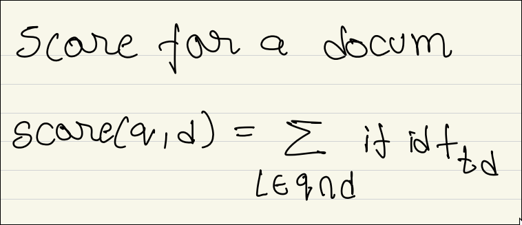

# Doubts

## Q1. What does this mean?

## Q2. I do not completely understand locally sensitive hashing.

Yeah

## Q3. How does the better version of the Euclidean formula help?

## Q4. I do not fully understand the covariance version of the Euclidean Distance formula?

## Q5. When is KL divergence loss used?